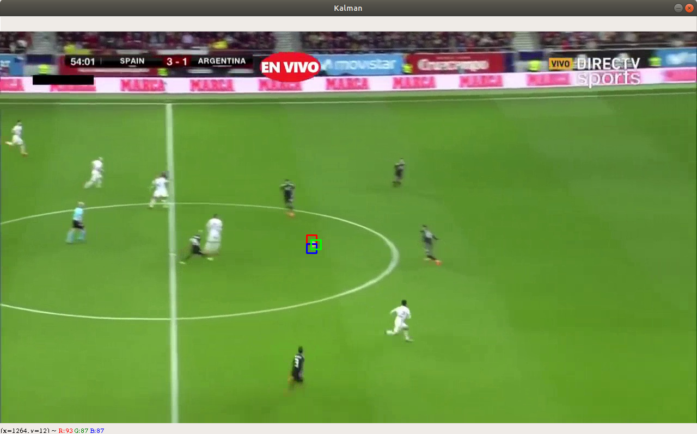
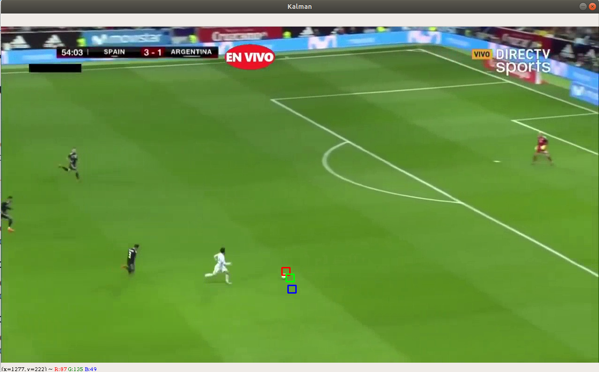

# Estimación de valores de Q y R
Se pretenden estimar los valores Q y R que mejor ajustan el resultado 
para cada uno de los archivos de medidas.

## ball_5.csv
Los mejores valores para el csv ball_5.csv son:

Q = 0.1

R = 0.1

Con estos valores se consiguen resultados 

Se marca con un rectángulo rojo el valor de la detección, con azul el valor
de la predicción y en verde la corrección.

## ball_10.csv
Los mejores valores para el csv ball_10.csv son:

Q = 0.001

R = 0.01

Con estos valores se consiguen resultados como los siguientes:

Se marca con un rectángulo rojo el valor de la detección, con azul el valor
de la predicción y en verde la corrección.

## ball_20.csv
los mejores valores para el csv ball_20.csv son:

Q = 0.001

R = 0.1

con estos valores se consiguen resultados como los siguientes:
