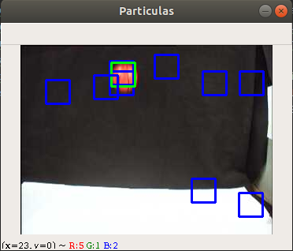

# Filtro de particulas

Para la implementación del algoritmo se han seguido los siguientes pasos:
* __Inicialización__: Se inicializan las párticulas en una posición aleatoria de la imágen.
Si a lo largo de la ejecución, se pierde la detección del objeto se volverán a inicializar 
las partículas. Cuando estamos en la fase de inicialización las partículas se ven de color azul.

* __Evaluación__: Para cada partícula se calcula la "cantidad" de objeto que hay en ella mediante un
filtro de color y se les asigna un peso.

* __Estimación__: seleccionamos la partícula con mayor peso y almacenamos su posición. La partícula
de mayor peso está representada en verde.

* __Selección__: Mediante el método de la ruleta se genera un nuevo conjunto del mismo número de partículas. Este nuevo conjunto de 
partículas estará representado en rojo. Muchas de estas nuevas partículas comparten posición.

* __Difusión__: Se añade un desplazamiento al nuevo conjunto de partículas. Las partículas vuelven a estar
representadas en azul.

* __Predicción__: A partir de la posición del frame anterior y del frame actual de la partícula de
mayor peso se predice la posible posición del objeto en el siguiente frame desplazando todas las partículas
en la misma dirección del movimiento anterior observado. Esta predicción se representa con las partículas
en rosa.

